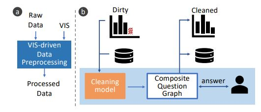

Week 1 Reflection - Applying Machine Learning Advances to Data Visualization: A Survey on ML4VIS
--
This article is a survey regarding how machine learning can be used for data visualization, and was published by Qianwen Wang, Zhutian Chen, Yong Wang, and Huamin Qu
on Dec 1st 2020. [Read the article here.](https://www.researchgate.net/profile/Yong-Wang-149/publication/346555391_Applying_Machine_Learning_Advances_to_Data_Visualization_A_Survey_on_ML4VIS/links/603cd29e92851c4ed5a5590d/Applying-Machine-Learning-Advances-to-Data-Visualization-A-Survey-on-ML4VIS.pdf)

This paper is pursuing two primary goal: 

1) How Machine Learning models are crucial to the visualization process. 
2) What machine learning models are appropriate for resolving data visualization problems. 

Six different processes can be highly influenced by machine learning techniques and models, which are the component of a pipeline named as ML4VIS: 

Figure 1 This image depicts the data pipeline and the six visualization processes that are involved in a visualization process. 

1) VIS-driven Data Processing 

In this stage, Machine learning algorithms are used to make preprocessing easier and efficient as well as enhance human perceptions on data like using dimension reduction to better visualize high dimension dataset.

Figure 2

2) Data Presentation

In the presentation stage, machine learning models can be used for visualization recommendation as well as improving the efficiency of creating visualizations like reducing cost on high computational cost visuals, maps, etc.

Figure 3

3) Insight Communication 

This part would be more heavily related to natural language processing because it would require a model to convert some insights described by texts to images or visualizations. 

Figure 4

4) Style Imitation 

Machine learning is also crucial to this phase because selecting proper color and layouts are very crucial for conveying ideas precisely and with great tones.

Figure 5

5) VIS Interaction

CNN and other type of models can be used to refine results from interaction, predicting next steps from users, and learning about its users. 

Figure 6

6) VIS Perception 

Models used in this part is more angled towards understanding the story of the visualizations to draw proper conclusions to aid decision making process. 

Figure 7
