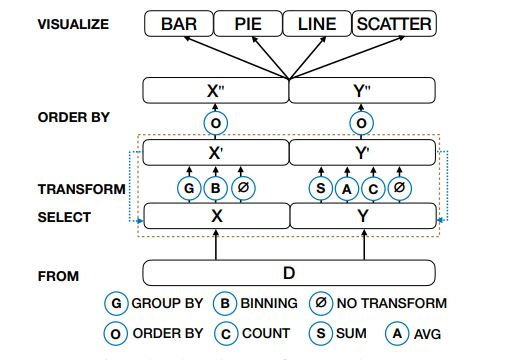

Week 2 Reflection - DeepEye: Towards Automatic Data Visualization
--
This article is about data visualization recommendation for analysis representation based on different scenarios, and is published by Yuyu Luo, Xuedi Qin, Nan Tang, Guoliang Li in 2018. [Read the article here.](https://ieeexplore.ieee.org/abstract/document/8509240?casa_token=26p8g2YxIMAAAAAA:xS0dGfBDg-A8dTFEgHmOwMV4qgcq5c8cZ1vbta_RrF9NmVgeSEZQmntYWtAqS58AsqfIvXib)

This paper is pursuing three primary goal: 

1) Wheteher a visualization for a given scenario is good or bad.
2) Comparison of two visualizations on whether one is better than another.
3) Find top-k visualizations for a given dataset. 

A model named DeepEye is developed for these puproses. It utilizes a supervised model to rank visualizations and relies on previous experts' knowledge on specifing rules for the supervised learning rules to increase specialization towards different fields. 

The algorithm is shown as below. It is divided into three parts: select, transform and order by. In the selection part, it takes in any ordered column pairs for visualization, and use transform to manipulate with one or the other column to either group or aggregate the data for further ranking. In the ranking process, the groups of aggregated data are then examined for the effectiveness on conveying the information of the two chosen columns. However, an interesting finding is that users generally prefer bar, line or pie charts. The considerations of other charts are then saved for future usages. 

This essay has an interesting combination and approach to discover the usage of machine learning for visualization selection. By utilizing this approach, data visualization dashboard could be more useful and insightful. However, given the data that most users are only in preference for bar, line or pie charts, it may seem unnecessary for developing this type of tools. 