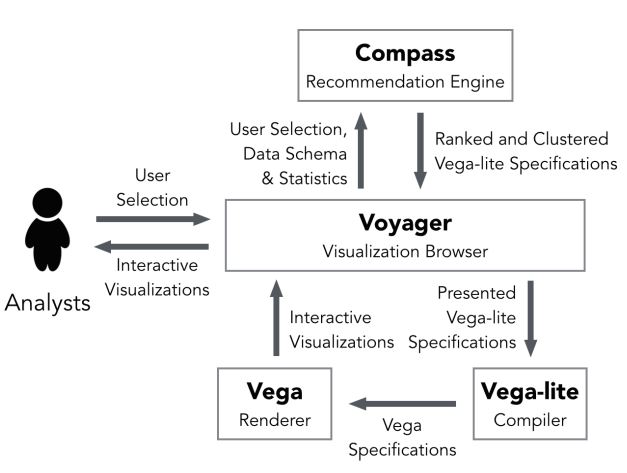

Week 3 Reflection - Voyager: Exploratory Analysis via Faceted Browsing of Visualization Recommendations
--
This article tries to provide a solution to complement manual chart construction with interactive selections within a group of auto-generated visualizations, and is published by Kanit Wongsuphasawat, Dominik Moritz, Anushka Anand, Jock Mackinlay, Bill Howe, and Jeffrey Heer in 2016. [Read the article here.](https://ieeexplore.ieee.org/abstract/document/7192728/)

This paper proposed a data visualization selection framework Voyager, which leads to a more facilitated process of choosing proper data visualization for a given dataset and deliver an opportunity to include some hidden and previously unseen data analysis which finally leads to increased data variable coverage.  It tries to target towards the data variation instead of design variation in order to uncover relationship between data. Furthermore, because analysts can change their interests in data as they proceed with exploration, Voyager provides an interactive feature to store people's preference for more accurate recommendations. However, being aware that this system is used for recommendation, biases may occur in the process. Therefore, a set of effectivness and expressiveness metrics and criteria should be in place to prevent these things to happen.

Trying to increase the efficiency for people to choose from charts, Voyager provides the ability for people to promote reading charts by aligning multiple charts in context. Also, knowing the fact that one chart could have multiple variations, Voyager offer the users ability to tune for their own charts as well as saving historical results for revisit and follow-up analysis. The following graph shows the flow chart for how users interacts with the system. 

