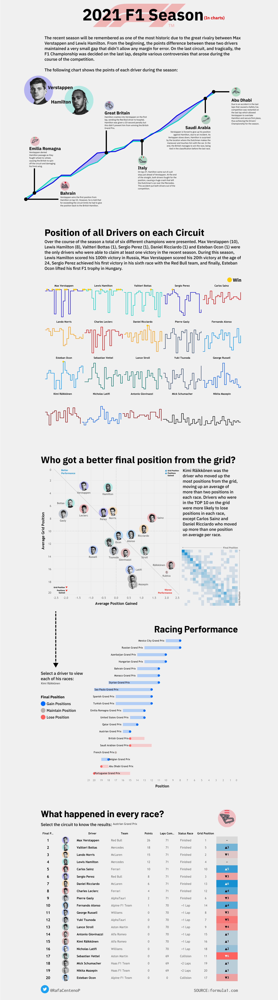

For this weeks reflection I chose to find a visulazation on the 2021 Formula 1 season. After looking searching for a bit, i was able to find a cool viz made on tableu that sumarrizes the whole season using a set of different charts. 
- It starts up with a time line chart that shows in any given race of the year who of the two top contenders was ranked first. and it highlights the key moments of the season that lead to the final result. 
- Then it has a line chart for each one of the drivers that represents the position they finished at in said races. adding a yellow dot to showcase they won that race. 
- Then it has a scatter plot to analyse the who had the better performace during the season by looking at the start postion vs end postion on average. And this is supported by a graph the can be expanded for each player. 
- Lastly we have the table that shows the positions of the players on each one of the races and how many points the got. 

https://public.tableau.com/app/profile/rafael.centeno/viz/2021F1Season/2021F1SeasonInCharts

