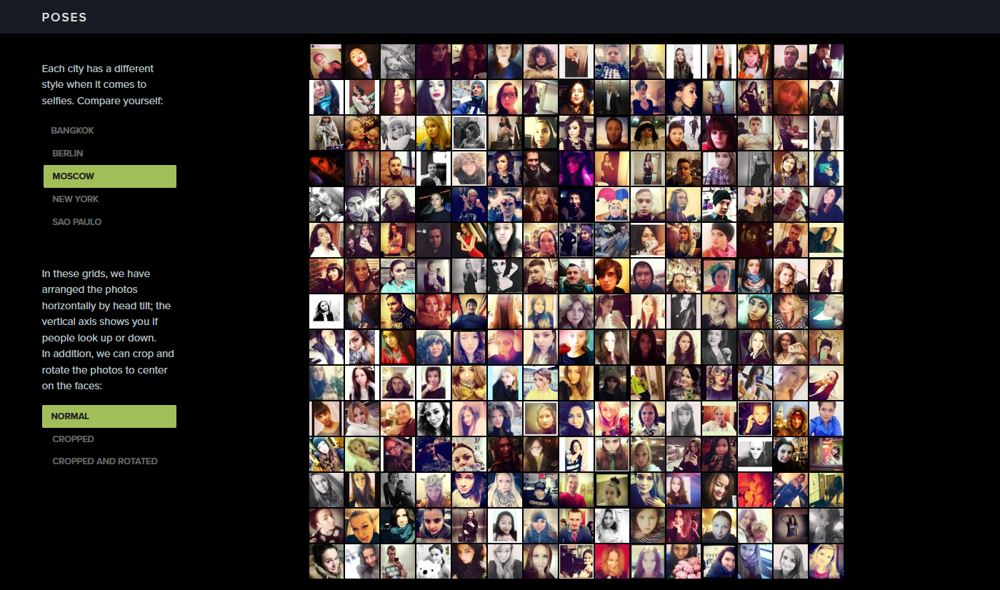
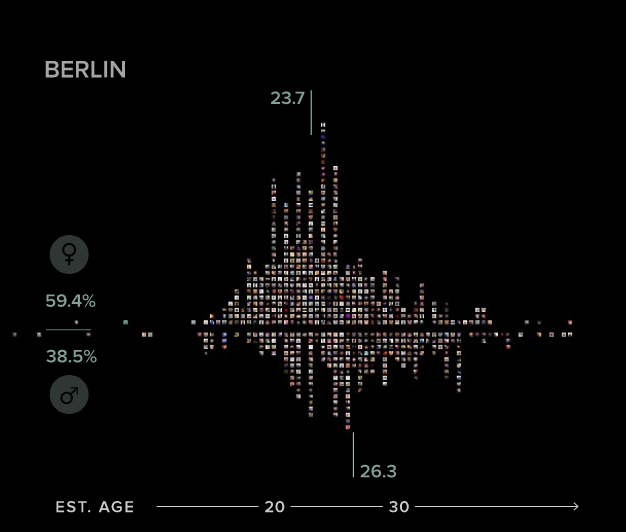
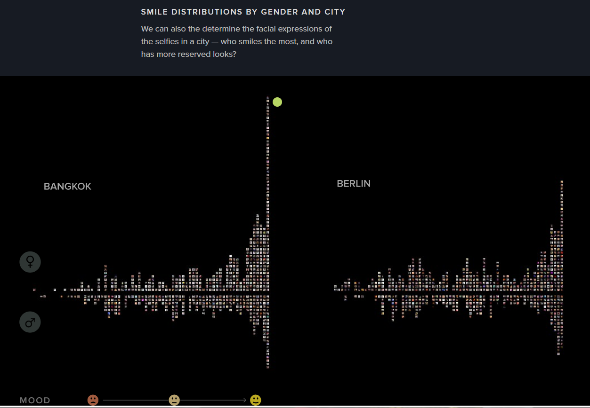
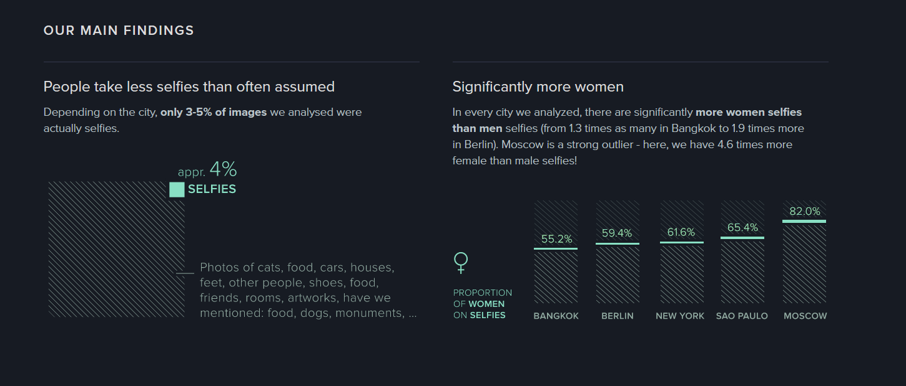
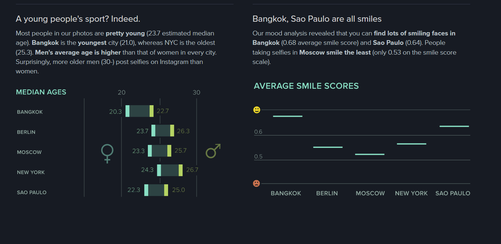
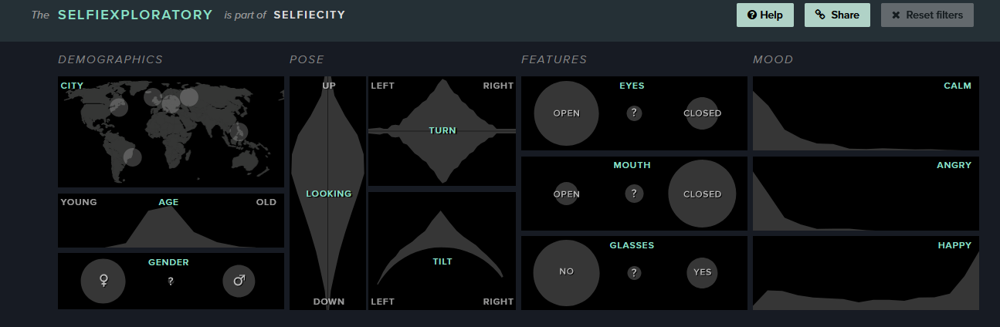

# Week 4:

My reflection for this week is [this website](http://selfiecity.net/)

## Description:

This website investigates the styles of selfies in 5 different cities across the world. They have made some really interesting and visualizations. It is a very unique topic as well.

## What I found interesting?

1. The website starts with explaining what the website is about and what they have done

2. The first visualization shows us a grid of the selfies from the different cities they were collected from. 

3. The next visualization shows us the various faces from the grid on to a graph showing demographics of the people taking those selfies. There are 5 charts for the 5 cities. One is as shown

4. The next visualization then looks at the smile distribution of the people. It plots the mood of the people in the selfies. 2 cities are as shown:

5. They have then explained how the data was collected and their major findings.

6. They also have a selfieploratory page where you can analyse and filte selfies by some provided filters as shown and the link to that is [here](http://selfiecity.net/selfiexploratory/)

