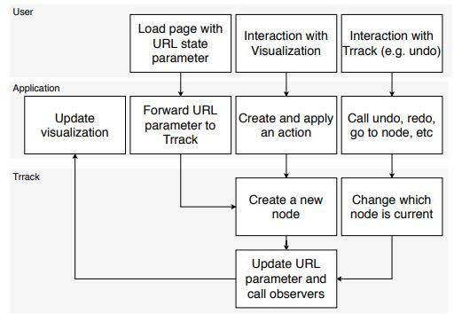

Week 4 Reflection - Trrack: A Library for Provenance-Tracking in Web-Based Visualizations
--
In order to expand visualization designers' abilities to manipulate with data visualizations like action recovery, reproducibility, collaboration and sharing, Zach Cutler, Kiran Gadhave and Alexander Lex proposed a library named Trrack in 2020. [Read the article here.](https://sci.utah.edu/~vdl/papers/2020_visshort_trrack.pdf)

The library is a combination of four visualization tools: user interaction captured when interact with plots, a visualization system for blood product management, a visualization system for modeling workforce needs in the medical sector, and two network visualization tools used in a large study for validating design and crowdsourcing approach. With all these combination, the library is set to achieve the goals of allow developer agency, support action recovery, support reproducibility, support collaboration, support meta-analysis, support annotation, highlighting, bookmarking, and provide UI elements and provenance visualization. The relationships among the user, application and Trrack library is shown as the following image.

There are two architecture approaches towards the system: state-based and action-based. It is because state-based system store utilizes user-dfeined state of the application which allows instant jumps from any node in the history; however, this means that the system is inefficient use of memory or disk space. On the other hand, action=based systems required to get from one node to the next, meaning it can lead to slow performance when jumping between states. But this shortage can truly reduce storage and memory usage. Thus, using a hybrid approach to combine the advantages can make advancement on the tracking of user interaction history. In Trrack, this usage of different states tries to resolve storage problem by store the difference between the current node and last node. 