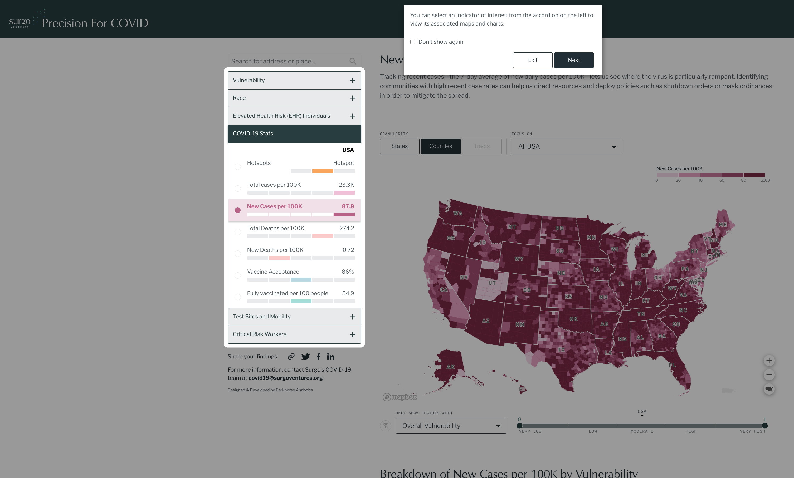
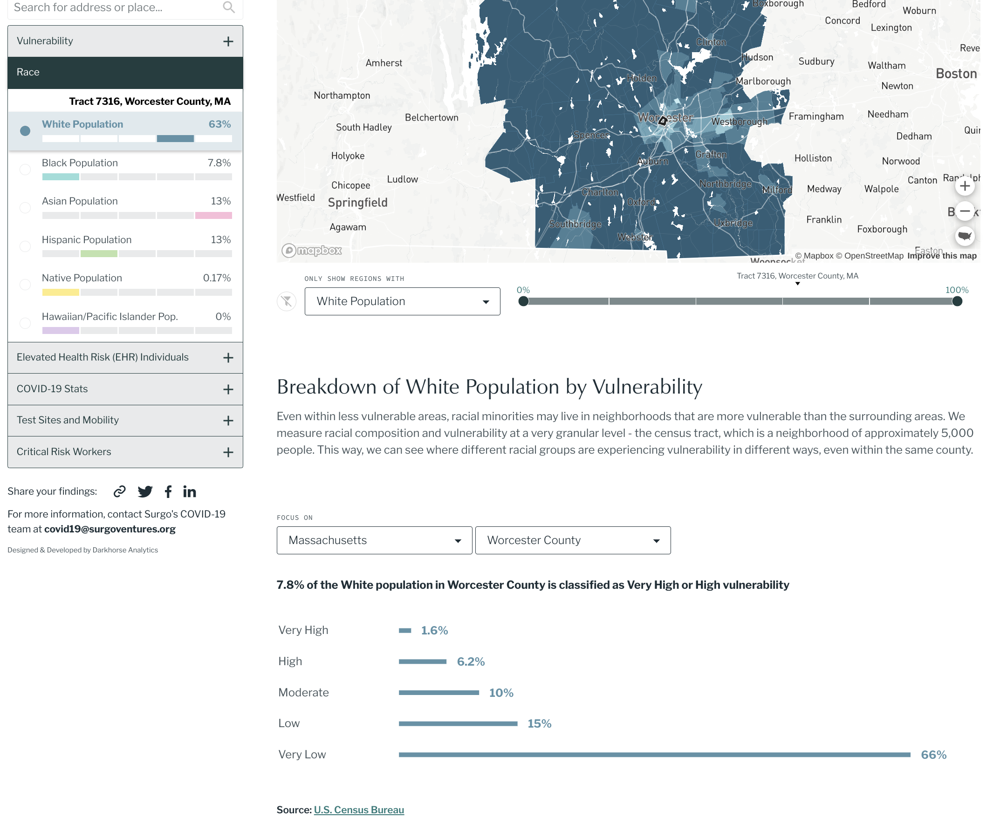
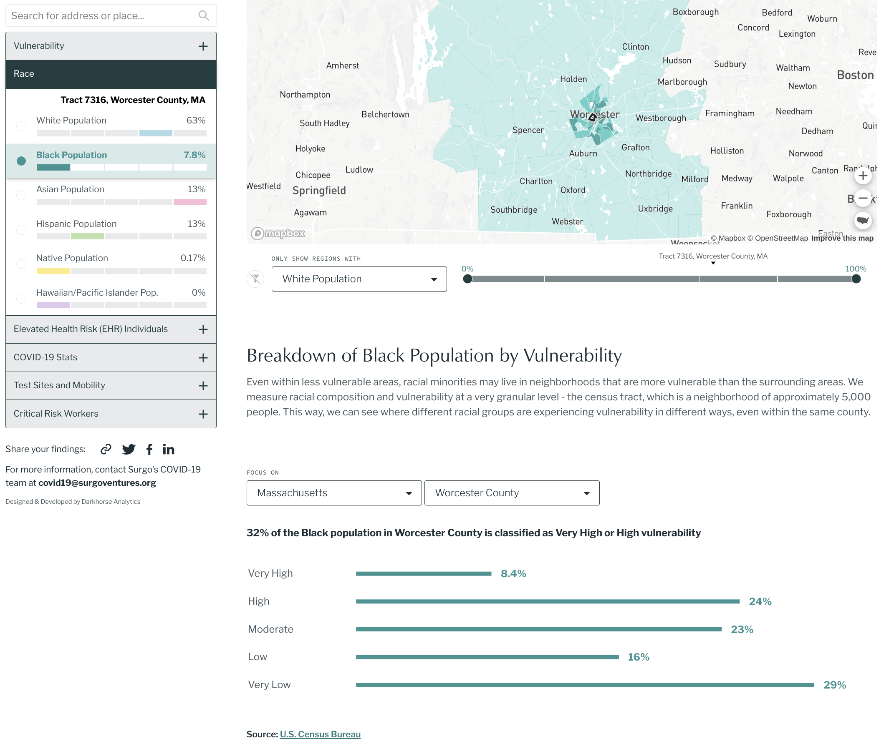
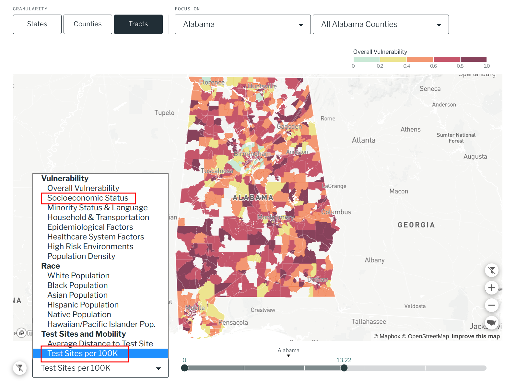

# Reflection 4
Hilson Shrestha

My reflection this week: 
https://www.precisionforcoviddata.org/

## Community Vulnerability to COVID-19

This is a visualization of US communities' vulnerability to COVID-19. It shows where the virus is spreading fastest and overlays information such as race, test sites, critical risk workers.

The visualization begins by showing us a guide on how to use the system because some different controls and selections can be made. 

On the left, there is an area for category selection. And on the right is a map that displays a map associated with the selected category. We can use a search bar to look into a particular state or city. One cool thing about this visualization is the use of filters. For example, for any given selection, the user can filter out the states or counties by high or low vulnerability, or filter by race.

Furthermore, there is a breakdown of vulnerability by population percentage.

Another thing that I noticed here is how the data in the category selection reflects the region selected on the map. If we are viewing the map of the entire country, the data on the left summarizes the entire US population. But if we select a particular county without changing any filter, the data on the left reflects that selected county.

I think a possible improvement for this visualization is by combining multiple filters at once. eg. I want to view areas with high socioeconomic status and low test sites.

