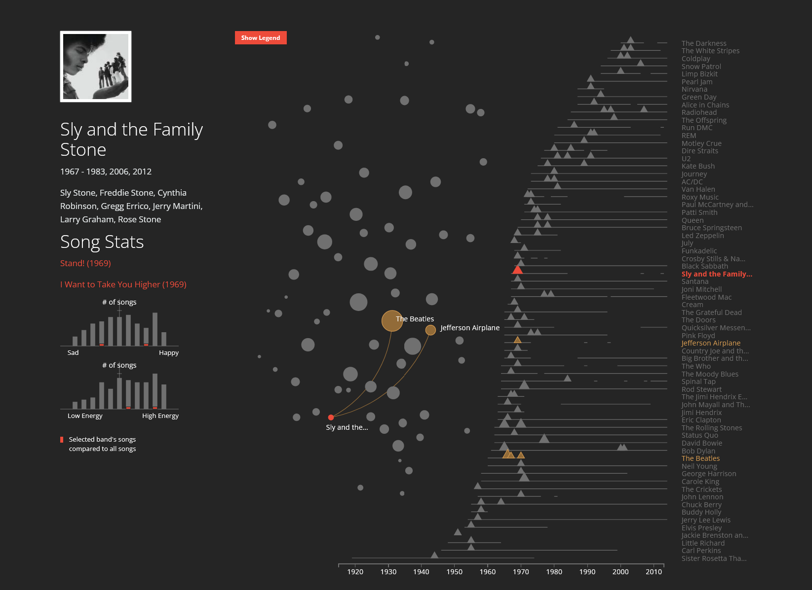

# Reflection Week 5
James Plante  
February 14, 2022

This week, I tried to find an interactive visualization that was not from mainstream outlets that 
would visualize a subject I was interested in. In doing so, I found this visualization by Susie Lu,
John Akred, and Silicon Valley Data Science called "History of Rock in 100 Songs". This exploratory
visualization allows users to explore the history of rock/metal music based on a curated list of 
100 songs by the Guardian. This visualization interested me because I had taken a music course
last year that covered the history of American pop music and knew a lot of the content on here.

The main point of exploration that the user has is selecting a group either from a network visualization in the middle of the screen or a timeline on the side with a list of all of the bands in reverse chronological order by their start date. What I found interesting was that they had incorporated multiple
datasets allowing them to visualize the influences and influencees of the artist as well as what songs
were selected by the Guardian in terms of their relative valence (mood) and energy. I also liked
their use of complementary colors for the network to make the highlighted elements stand out.
While I found this  visualization very useful, I wish that there was an initial pop-up with the 
legend on how to interpret the network visualization since while I could get the gist of what it was doing from my background knowledge, I didn't get the full picture on what was going on until I
looked at the small "Show Legend" button in the top left corner of the screen.

[link to visualization](https://svds.com/rockandroll/#slyandthefamilystone)