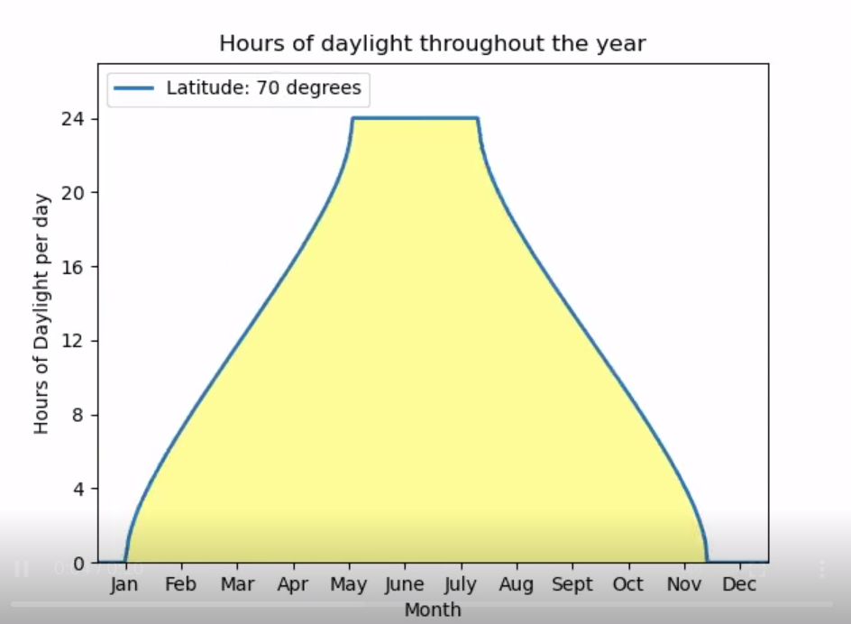

# Week 5 Reflections

My reflection this week: 
https://www.reddit.com/r/dataisbeautiful/comments/sriztv/oc_an_updated_version_of_my_animation_that_shows/

## Hours of daylight throughout the year

This is a simple animated visualization of how the duration of sunlight varies across the latitudes. It is built using python and matplotlib. Relating to Munzner's tasks abstraction, this probably falls under "enjoyment" purpose.

A slowed-down version of this visualization is available here https://imgur.com/a/9UoguN5

In this animated visualization, the x-axis shows the month of the year and the y-axis shows the hours of daylight per day. The variable being changed is the latitude. It changes from -90 degrees to 90 degrees (representing south pole and north pole respectively).

This visualization looks so weird given that the line goes from being curved to completely flat. However, if we take the earth's tilt of 23.5 degrees from the y-axis into account, clearly explains the phenomenon.

The reason I chose this visualization for reflection, even though is so simple, is that I had seen some of these timelapse videos of the sun in the North pole regions and it always looks cool.

https://www.youtube.com/watch?v=ndlQNicOeso

https://www.youtube.com/watch?v=m4NJHI3dwTU

An alternative to this visualization in my opinion is to use latitude on one of the axes and varying month as a variable to animate.