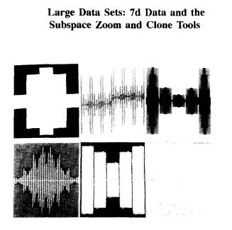

Week 5 Reflection - Visualizing a Scalar Field on an N-dimensional Lattice 
--
In data analysis, there are always times that we need to handle the case with multiple variables in order to find their relationships as well as importance, in the paper propsed by T.Mihalisin, E.Gawlinski, J.Timlin and J.Schwegler in 1990, it utilizes a N-dimensional Lattice to represent all relations. [Read the article here.](http://dx.doi.org/10.1109/VISUAL.1990.146389)

The technique is used because it would be easy to consider the case where we have 3 dimensions or 4 dimensions because adding some axes would offer a fast and direct solution. However, with 4 dimensions or larger scale, there would be some difficulties with adding axes and represent them. This proposed technique is only funtioning within the scope of data from all dimensions are equal-increment. This technique can be described in either an active or a passive manner. In the active view the points of the N-dimensional independent variables lattice are mapped to a single horizontal axis in a hierarchical manner to be described. In the passive view, an observer samples the points of the N-dimensional lattice in a prescribed fashion and notes the values of the dependent variable. One of the example of using this technique is as the following:

There's still space for the technique to improve, and I think most be solved in future papers after 32 years. The technique is still missing the ability to support rotations, independent variable transformations and other operations requiring missing values support. Moreover, the ability to deal with randomly sampled independent variables.
