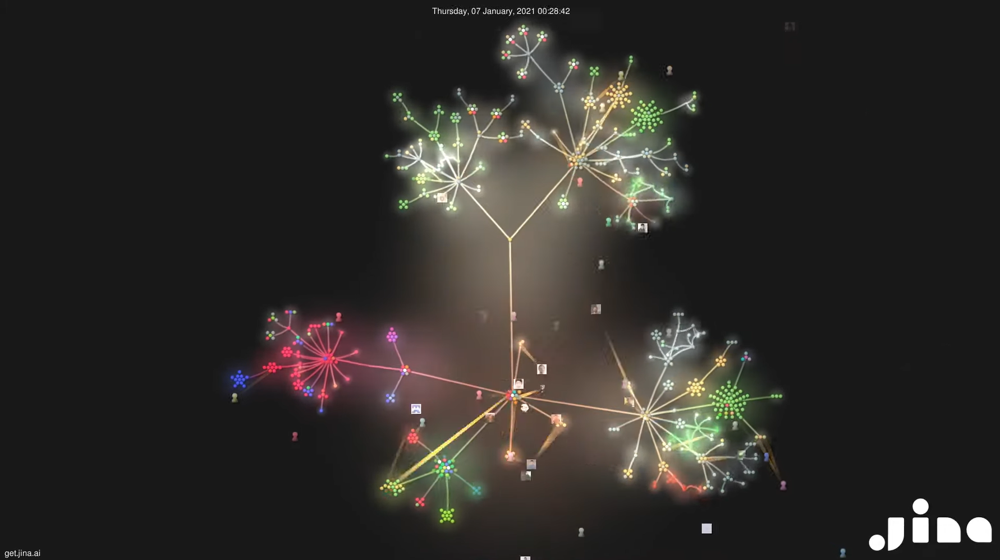

# Week 6 Reflections

[Link to Visualization]

For this week I looked at an interesting visualization showing a timelapse of version control for an open source project
(Jina). Generally speaking, visualization of version control systems is already reasonably well-developed in the form of
tree graphs to show commit/branch/merge history. However, these graphs have a downside in that they can become very
long/tall and can be less useful when viewing a project with many branches but little activity. While less practical,
this visualization was an interesting way of solving that problem in a somewhat chaotic manor. It shows the current
state of a project at a given point of time. Each dot represents a single commit and each cluster represents a branch.
Lines are then drawn between branches as they are formed. The area where this visualization really excels is in projects
with many branches. Since the primary goal of this visualization was looking cool, it was missing some important
information such as labels for branches and contributors, but this could be fixed for a more practical application. I
believe it could additionally benefit from removing the glow effect and not displaying contributors on the graph area to
reduce clutter.

[Link to Visualization]: https://www.youtube.com/watch?v=S_LmnlaWhzo