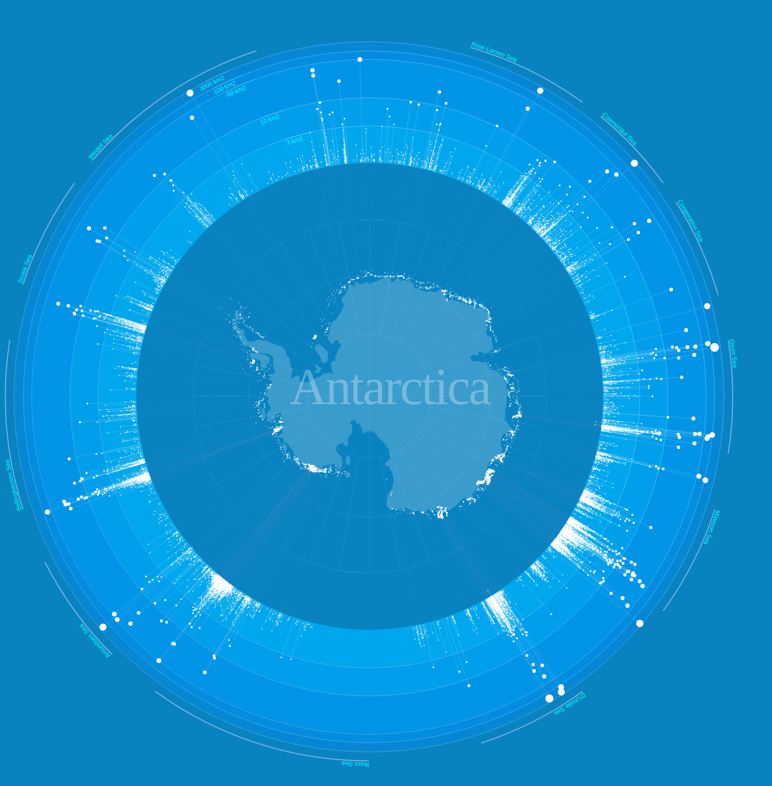
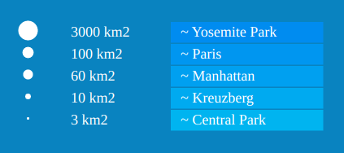

# Week 6 Reflections

My reflection for this week:
https://graphicprototype.net/icebergs/

This is a visualization of 7000 icebergs around the coast of Antarctica. The data were collected in 1997.

This visualization has outlined the map of Antarctica with white dots to represent the position of icebergs around the coast. However, just displaying the position and size using circles would be very difficult to identify large or small icebergs given the massive size of Antarctica. So, this visualization draws lines radially outward from the position of the icebergs and represents the size of the iceberg not just with the radius of the circle but also the distance of the line from the circular baseline. A logarithmic scale is used here because iceberg sizes vary a lot.

For scale comparison, they have a legend with an approximate size of cities or places. This gives us a sense of how huge the iceberges actually.

This visualization has also labeled the nearby seas around Antarctica. We cannot put an arrow representing North since every direction we move will point to the north from here. However, I feel that adding the nearby countries name would give more sense of position on the map because most people are not familiar with the names of the sea around Antarctica. 

I think it would be really interesting how the icebergs have changed over the years. And a possible exploration of this visualization could be a use of timelapse over the years. With global warming, do we see a decrease in the density of the icebergs and their sizes?