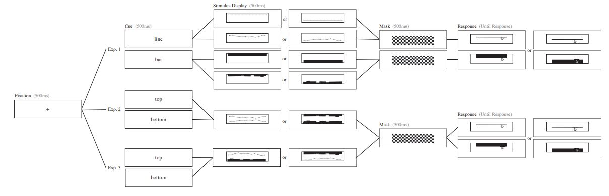

Week 6 Reflection - Biased Average Position Estimates in Line and Bar Graphs: Underestimation, Overestimation, and Perceptual Pull
--
Using data positions, for instance the height of a bar, the dot positions in dot plot, the angle of a line, etc. is the most common way to estimate the average of a group of data. However, there are other elements in a visualization that would lead to miss interpreting the average. This is a conclusion from the study by Cindy Xiong, Cristina R. Ceja, Casimir J.H. Ludwig, and Steven Franconeri. [Read the article here.](https://ieeexplore.ieee.org/abstract/document/8805427?casa_token=_ijd7q4F58YAAAAA:9Jj-e8XJgJEC-1OVSDyYGFbIXYi-HyBv3TVAHuFcDO7AEJ246PNXE48H8AuXQ3SG7OeJNDlV)

This idea is introduced as perceptual biases. Perception of visual manitudes can be biased across multiple feature dimensions. Therefore, the group set forth the idea of just looking at visualizations with either bars or lines, but altering other elements. They designed three experiments shown as the following:

By putting line chart and bar chart together, they have tried to compete and see the result of how people depict and understand the average from the charts. This actually inspires me on how our group could arrange the experiments to figure out a good way for visualization experiments on knowing which visualization technique is the best for describing the data we would like to depict. 
