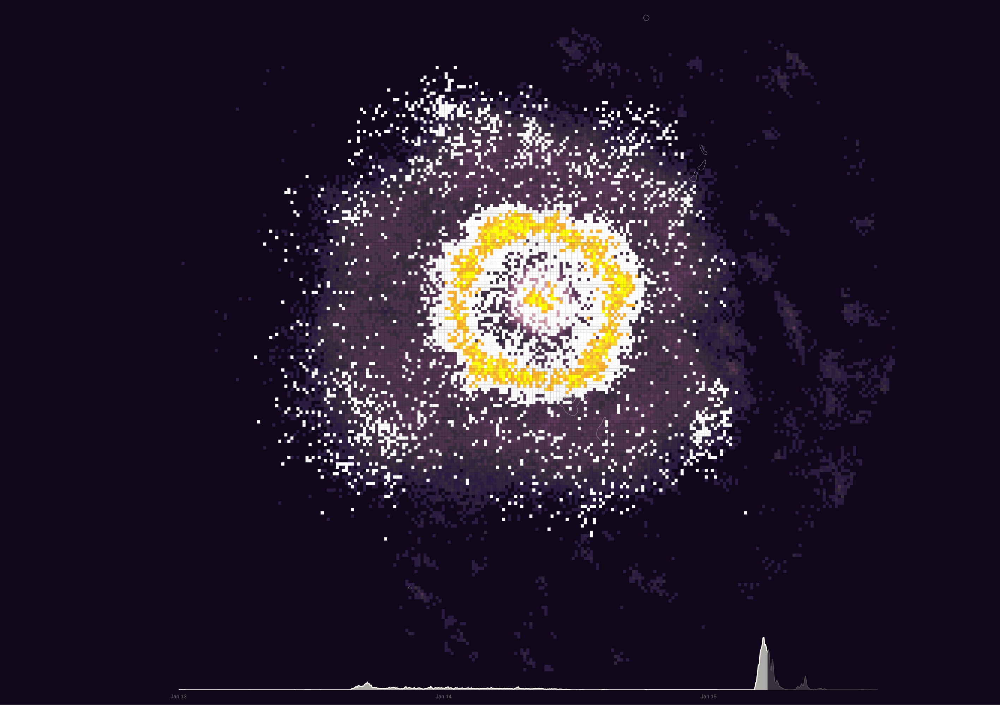

# Week 7 Reflection

My reflection for this week:
https://graphics.reuters.com/TONGA-VOLCANO/LIGHTNING/zgpomjdbypd/index.html

## The perfect storm: Tongo Eruption

This is a visualization of all the lightning strikes during the Tongo volcanic eruption. It is basically a heatmap with timeline at the bottom. Heatmap is overlayed on top of the map of Tongo region. Lightlning strikes in a small region is represented by by a square dot. Color of the square dot represents the number of lightning strikes in that particular area. The timeline at the bottom also has line chart representing the number of strikes at that time.

This visualization shows the massive scale of the eruption. The website also has charts of other volcanic events for comparison.

One thing I really like about the visualization is the use of timeline with heatmap. Initially, the heat is empty with just the outline of the countries. Then the dots show up for current lightning activity at a particular time. Then the color fades to represent a past time.